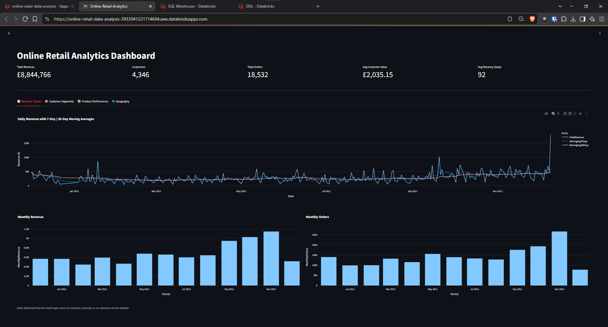
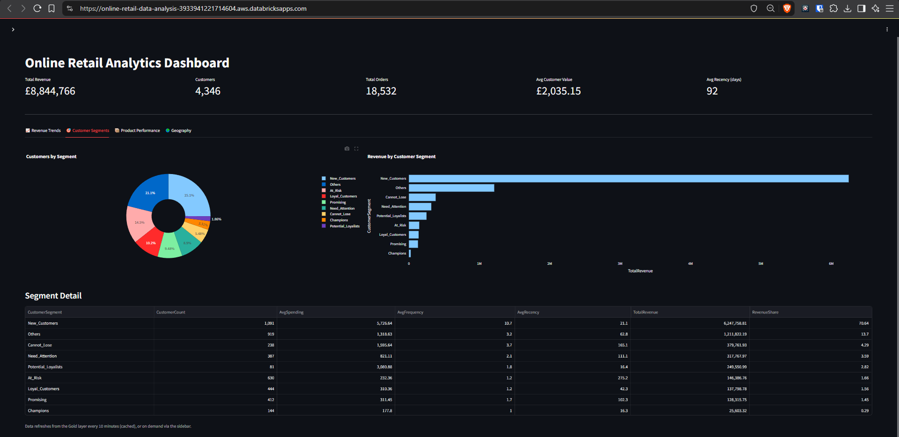
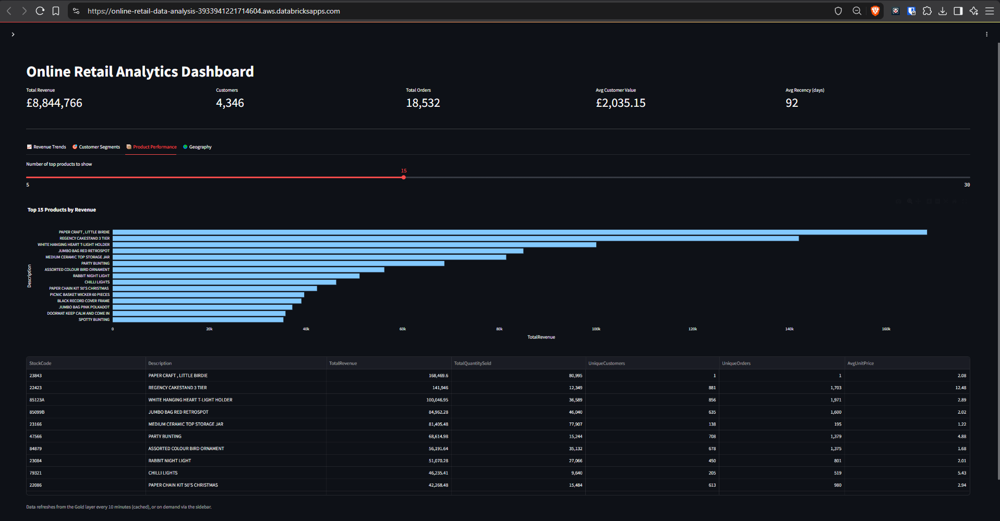
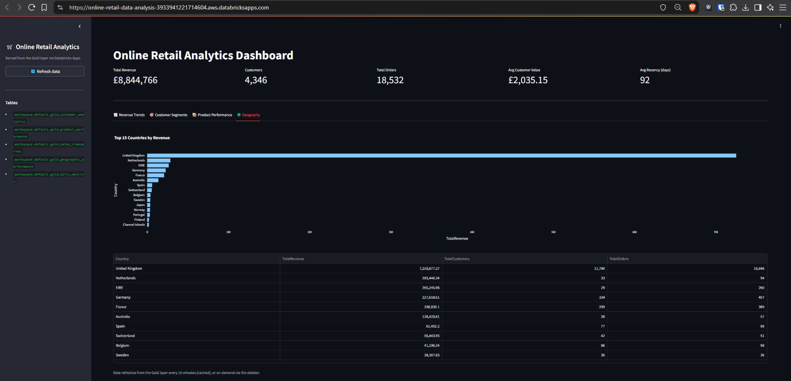

# 🛒 Online Retail Analytics — Databricks App

A **Streamlit-powered Databricks App** that serves interactive analytics dashboards from the **Gold layer** of an [Online Retail](https://archive.ics.uci.edu/ml/datasets/online+retail) medallion pipeline. The app queries Gold-layer Delta tables via a Databricks SQL Warehouse and visualises KPIs, revenue trends, customer segments, product performance, and geographic breakdowns — all in real time.



---

## ✨ Features

| Tab | What it shows |
|-----|---------------|
| **📈 Revenue Trends** | Daily revenue with 7/30-day moving averages, monthly revenue & order bar charts |
| **🎯 Customer Segments** | RFM-based customer segmentation — pie chart, revenue by segment, and a detail table |
| **📦 Product Performance** | Top *N* products by revenue (adjustable slider) with a data table |
| **🌍 Geography** | Top 15 countries by revenue with per-country customer & order counts |

Header KPIs visible on every tab: **Total Revenue · Customers · Total Orders · Avg Customer Value · Avg Recency (days)**

---

## 📸 App Screenshots

### Revenue Trends
Daily revenue time-series with moving averages, plus monthly revenue and monthly orders bar charts.


### Customer Segments
RFM-based customer segmentation with a donut chart showing customer distribution and a horizontal bar chart showing revenue contribution per segment, backed by a detail table.



### Product Performance
Top products ranked by total revenue, with a configurable slider to control how many products are displayed. Includes stock code, quantity sold, unique customers, and average unit price.



### Geography
Top 15 countries by revenue with a breakdown of total customers and total orders per country. The sidebar lists the five Gold-layer tables powering the dashboard.



---

## 🏗️ Architecture

The app sits on top of a **Medallion Architecture** pipeline that progressively refines the [UCI Online Retail](https://archive.ics.uci.edu/ml/datasets/online+retail) dataset:

```
UCI Dataset ─► Bronze (raw + cleaned) ─► Silver (enriched) ─► Gold (analytics tables) ─► This App
```

The app **reads only from the Gold layer**, which consists of five pre-aggregated Delta tables:

| Gold Table | Description |
|------------|-------------|
| `gold_customer_analytics` | Customer-level RFM scores and segments |
| `gold_product_performance` | Revenue, quantity, and popularity metrics per product |
| `gold_sales_timeseries` | Monthly aggregated sales data |
| `gold_geographic_performance` | Revenue and customer metrics by country |
| `gold_daily_metrics` | Daily KPIs — revenue, orders, and moving averages |

> For full details on the ETL pipeline (Bronze → Silver → Gold), RFM segmentation logic, and the underlying dataset, see the [upstream analysis project](https://github.com/Neel-XV/online-retail-data-analysis).

---

## 🚀 Deployment

### Prerequisites

- A **Databricks workspace** with a SQL Warehouse
- The Gold-layer Delta tables already created (via the upstream notebook)
- [Databricks Apps](https://docs.databricks.com/en/dev-tools/databricks-apps/index.html) enabled on the workspace

### Project Structure

```
├── app.py              # Streamlit dashboard application
├── app.yaml            # Databricks App configuration (env vars, command)
├── requirements.txt    # Python dependencies
├── viz/                # App screenshots
│   ├── dbx-landing.png
│   ├── dbx-segment.png
│   ├── dbx-top-countries.png
│   └── dbx-top-products.png
└── README.md
```

### Configuration

Environment variables are set in [`app.yaml`](app.yaml):

| Variable | Purpose | Default |
|----------|---------|---------|
| `DATABRICKS_WAREHOUSE_ID` | SQL Warehouse to query (injected from `sql_warehouse` resource) | — |
| `CATALOG` | Unity Catalog name | `workspace` |
| `SCHEMA` | Schema containing the Gold tables | `default` |

### Deploy to Databricks

1. Push this repo to your Databricks workspace (or link the GitHub repo).
2. Create a Databricks App pointing to this project.
3. Ensure the `sql_warehouse` resource is configured so `DATABRICKS_WAREHOUSE_ID` is injected.
4. The app will start automatically and be accessible at its generated `.databricksapps.com` URL.

### Run Locally (for development)

```bash
pip install -r requirements.txt
# Set required environment variables
export DATABRICKS_HOST="https://your-workspace.cloud.databricks.com"
export DATABRICKS_WAREHOUSE_ID="your-warehouse-id"
streamlit run app.py
```

---

## 📦 Dependencies

```
streamlit
databricks-sdk
databricks-sql-connector
pandas
plotly
```

---

## 📊 Data Source

| | |
|-|-|
| **Dataset** | Online Retail Data Set |
| **Source** | UCI Machine Learning Repository |
| **Link** | [https://archive.ics.uci.edu/ml/datasets/online+retail](https://archive.ics.uci.edu/ml/datasets/online+retail) |
| **Records** | ~541K transactions from a UK-based online retailer (Dec 2010 – Dec 2011) |

---

## 📄 License

This project is for educational and portfolio purposes. The dataset is provided by the UCI Machine Learning Repository under their [citation policy](https://archive.ics.uci.edu/ml/citation_policy.html).
